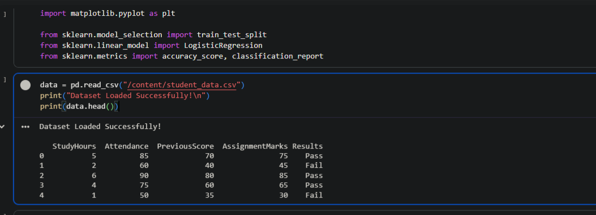
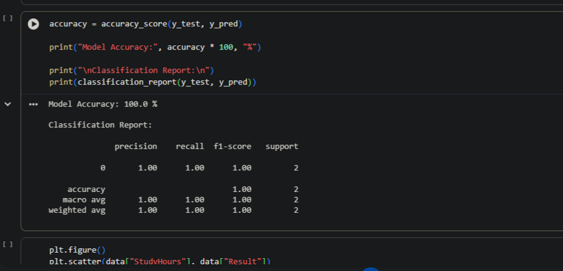
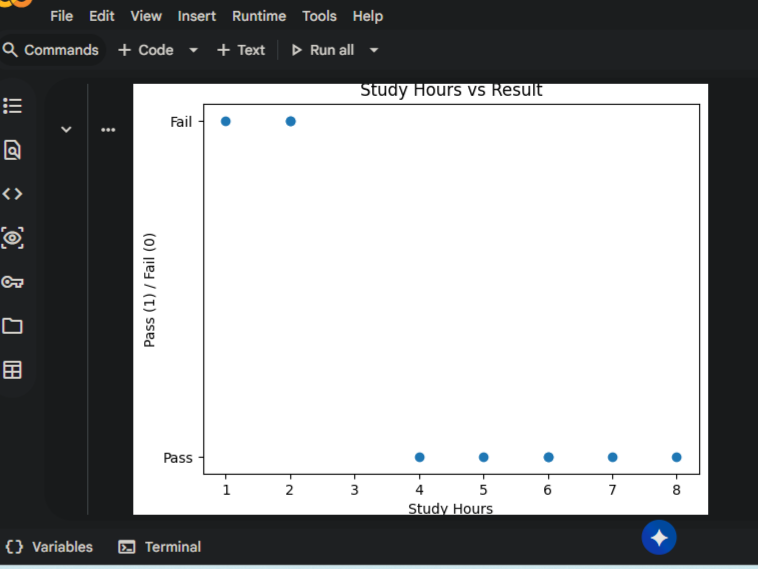
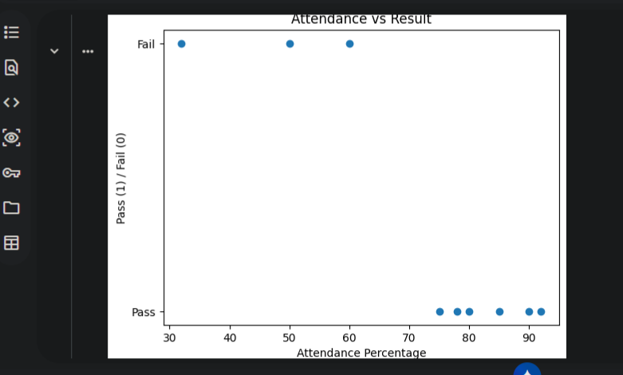

🎓 AI-Based Student Performance Prediction System

This project predicts whether a student will **Pass or Fail** using Machine Learning.

It uses academic factors such as:

- Study Hours  
- Attendance Percentage  
- Previous Exam Score  
- Assignment Marks  

The model is trained using **Logistic Regression**, a supervised learning algorithm for binary classification.

---

📌 Problem Statement

Manual analysis of student performance is time-consuming.  
This project automates prediction to help institutions identify weak students early.

---

⚙️ System Architecture

**Input:** Student Academic Data  
**Processing:** Data Preprocessing + ML Model Training  
**Output:** Pass/Fail Prediction  

---

🧠 Algorithm Used

- Logistic Regression  
- Binary Classification (Pass = 1, Fail = 0)

---

📂 Dataset Features

| Feature | Description |
|--------|------------|
| StudyHours | Hours studied per day |
| Attendance | Attendance percentage |
| PreviousScore | Previous exam marks |
| AssignmentMarks | Assignment performance |
| Result | Pass/Fail |

---

🚀 Project Workflow

1. Load Dataset (CSV)
2. Data Cleaning & Encoding
3. Train-Test Split (80/20)
4. Model Training
5. Accuracy Evaluation
6. Visualization
7. Final Prediction Output

---

📊 Output Screenshots

-Dataset Preview

-Model Accuracy Report

-Study Hours vs Result

-Attendance vs Result

Final Prediction Output

---

✅ Result

The system successfully predicts student performance as:

- PASS  
- FAIL  

Accuracy depends on dataset quality.

---

🔮 Future Scope

- Add a GUI using Tkinter  
- Use advanced ML models (Random Forest, SVM)  
- Deploy as a web application  

---

🏫 Internship Project

Internship Program – Artificial Intelligence  

---

👨‍💻 Developed By

**Shrutishree Panda (Student Intern)**
